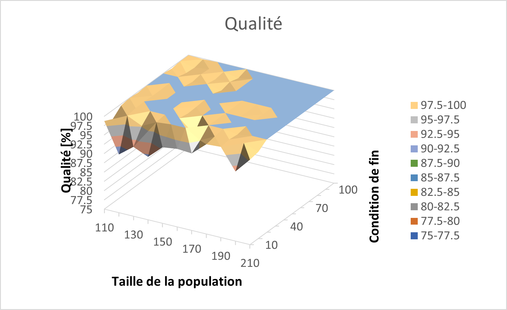
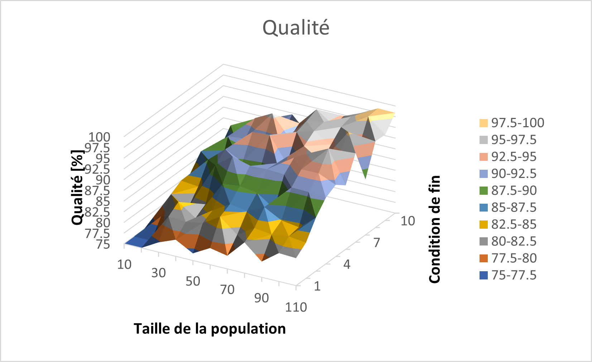

Optimisation
############

L'objectif de cette section est d'optimiser l'algorithme génétique, présenté précédemment, 
servant à la résolution du problème du sac à dos. Deux éléments différents sont étudiés : 
le temps d'exécution du programme, qui doit être minimisé, ainsi que la qualité de la 
solution obtenue, c'est-à-dire à quel point celle-ci est proche de la solution optimale. 
Nous alons la mesurer en comptant le nombre de bits de la solution obtenue semblables à 
la solution optimale et retourner cela sous forme de pourcentage. 
Or, ces résultats dépendent d'une multitude de paramètres différents et il est hautement 
probable qu'ils ne soient pas indépendants les uns des autres, ce qui nous empêche de 
trouver leurs valeurs optimales en les étudiant séparément. C'est pourquoi nous allons en 
étudier qu'un nombre restreint, à savoir les probabilités de croisement, avec un ou deux 
points, et de mutation, la taille de la population et la condition de fin. 

Il serait, de plus, intéressant d'étudier la façon dont les valeurs obtenues évoluent en 
fonction de la taille du génome relatif au problème. Cependant, le temps nécessaire pour 
trouver la solution optimale à l'aide d'une recherche exhaustive évoluant 
exponentiellement avec la taille du génome, il serait alors difficile de déterminer la 
qualité d'une solution pour une telle taille. Il faudrait alors trouver une autre façon 
de déterminer la solution optimale. En se basant sur l'exemple de l'introduction, il 
semble donc que 15 bits soit une taille adéquate et c'est celle-ci qui sera utilisée par 
la suite. Les valeurs présentées dans les graphiques ci-dessous sont des moyennes obtenues 
en répérant 100 fois chaque mesure. 

Pour s'assurer de l'indépendance des différents paramètres et ainsi éviter d'avoir des 
données biaisées, ceux-ci ont été testés deux à deux avec tous les autres. Toutes les 
paires ont été testées, pas seulement celles présentes dans les schémas ci-dessous. Il
en ressort qu'ils sont effectivement généralement indépendants car les résultats sont 
constants pour toutes les expériences. 

Probabilités de croisement et de mutation
=========================================

En étudiant ces deux paramètres ensemble, nous pouvons remarquer que, bien que ce soient 
tous deux des opérateurs génétiques, ils n'ont pas le même effet, tant sur le temps 
d'exécution que sur la qualité de la solution obtenue. 

Temps
-----

.. figure:: figures/Optimisation/cross_mut2.png
    :align: center
    :width: 400
    
    Temps d'exécution de l'algorithme en fonction des taux de mutation et de croisement

Du point de vue du temps d'exécution, le taux de mutation n'a qu'un effet négligeable, à part 
pour des valeurs proches de 0 ou de 1. Cela laisse supposer que pour de petites valeurs les 
chances de rester "coincé" au niveau d'un optimum local est plus grand, tandis qu'avec des 
valeurs trop grandes l'algorithme trouve plus difficilement une solution stable. Cependant, 
les différences sont assez petites pour pouvoir être négligées et tant que la probabilité de 
mutation reste entre 0.3 et 0.8, nous ne constatons pas d'influence particulière. 

Le taux de croisement, quant à lui, à un effet notable. En effet, plus celui-ci est grand, 
moins il faut de temps à l'algorithme pour trouver une solution. Cela prouve l'importance 
de cet opérateur, même s'il peut sembler superflu au premier abord. Prendre une partie du 
génome de plusieurs "bonnes solutions" différentes permet donc de créer un individu enfant 
mieux adapté au problème, malgré le caractère aléatoire de ce partage. 

Qualité
-------

.. figure:: figures/Optimisation/cross_mut_q.png
    :align: center
    :width: 400
    
    Qualité de la solution en fonction des taux de mutation et de croisement

Quant à la qualité de la solution retournée par l'algorithme, celle-ci semble être affectée 
plus ou moins de la même manière que le temps. Effectivement, le taux de mutation ne change 
pas de manière décisive la qualité de la solution, alors que le taux de croisement a un effet 
important. Une valeur proche de 1 permet d'obtenir une meilleure solution, ce qui correspond 
également à un temps plus court. Ainsi, il est possible de trouver une valeur pour laquelle 
les deux résultats sont optimisés en prenant un taux de mutation entre 0.2 et 0.8 et un taux 
de croisement plus grand que 0.8. 

Condition de fin et taille de la population
===========================================

À la différence des deux paramètres précédemment étudiés, ceux-ci ont tous les deux une 
importance conséquente sur l'algorithme génétique, en particulier sur son temps d'exécution. 

Temps
-----

.. figure:: figures/Optimisation/end_size_t.png
    :align: center
    :width: 400
    
    Temps d'exécution de l'algorithme en fonction de la condition de fin et de la taille de la 
    population

En effet, de manière générale, le temps que prend l'algorithme évolue linéairement avec chacun 
des deux paramètres. Pour la taille de la population, ce résultat est cohérent avec le fait que 
plus il y a d'individus dans chaque génération, plus il faudra de temps pour effectuer des 
opérations sur chaque individu. La linéarité relative à la condition de fin est également 
cohérente, car le nombre de générations générées par l'algorithme augmente en fonction de ce 
paramètre. 

On observe également une anomalie losrque les deux valeurs sont petites. Celle-ci provient 
sûrement de l'algorithme en lui-même car elle est tout le temps présente, indépendamment 
des valeurs que prennent les paramètres. 

Qualité
-------

.. figure:: figures/Optimisation/end_size_q.png
    :align: center
    :width: 400
    
    Qualité de la solution en fonction de la condition de fin et de la taille de la 
    population [10;110]x[10;110]

Le graphique ci-dessus nous indique que la taille de la population est grandemment responsable 
de la qualité de la solution. En effet, lorsque la population contient moins de 60 individu, 
la qualité de la solution ne dépasse que rarement 95% alors que ce résultat est presque tout 
le temps atteint pour des population plus grandes. Ainsi, le nombre d'individus contribue 
grandement à apporter de la variété génétique, permettant ensuite de générer de meilleures 
solutions. De plus grandes valeurs que celles déjà testées pourraient donc permettre d'obtenir 
des résultats encore meilleurs, et c'est effectivement le cas, comme le montre le graphique 
suivant :

    
    Qualité de la solution en fonction de la condition de fin et de la taille de la 
    population [110;210]x[10;110]

Aux alentours de 200, toutes les solutions sont donc optimales pour une condition de fin de plus 
de 30 générations. Cependant, cela a un impact négatif sur le temps car, à de telles valeurs il 
est minimum 1,5 à 2 fois plus long que pour 70 individus. Il faut ainsi choisir l'exigence qu nous 
avons par rapport aux solutions et à quel point nous sommes d'accord de sacrifier du temps pour 
que celle-ci soit meileure.

La condition de fin semble cependant avoir un effet limité car les résultats sont plus ou moins 
constants pour toutes les valeurs, en particulier pour une population conséquente. Ce résultat 
est cohérent compte tenu du fait que, si les autres paramètres sont optimisés, une solution 
quasiment optimale est trouvé en peu de générations et il ne sert à rien d'effectuer un grand 
nombre de génération dans l'espoir d'en voir surgir une meilleure. Nous pouvons également 
constater que, pour une condition de fin de 10, les résultats semblent moins bons, ce qui se 
vérifie dans le graphique ci-dessous, où la qualité est nettement inférieure. 

    
    Qualité de la solution en fonction de la condition de fin et de la taille de la 
    population [10;110]x[1;11]

Croisements à un ou deux points
=============================

Nous avons vu précédemment que les croisement aidaient grandement à la qualité des résultats. 
Cependant, dans les résultats précédents, la différence entre les croisements à un et à deux 
points est difficilement percevable. En ne variant seulement la probabilité de croisement, il 
est possible d'afficher les deux courbes dans un seul graphe, pour essayer de mieux visualiser 
la différence. 

..  only:: html

    ..  grid:: 1 2 2 2

        ..  grid-item::

            ..  figure:: figures/Optimisation/cross_two_t.png
                :align: center
                
                Temps d'exécution en fonction du taux de croisement pour un ou 
                deux points

        ..  grid-item::

            ..  figure:: figures/Optimisation/cross_two_q.png
                :align: center

                Qualité en fonction du taux de croisement pour un ou deux points

..  raw:: latex

    \begin{figure}[h]
    \centering
    \begin{minipage}{0.45\textwidth}
        \centering
        \includegraphics[width=0.9\textwidth]{cross_two_t.png}
        \caption{Temps d'exécution en fonction du taux de croisement pour un ou deux points}
    \end{minipage}\hfill
    \begin{minipage}{0.45\textwidth}
        \centering
        \includegraphics[width=0.9\textwidth]{cross_two_q.png} 
        \caption{Qualité en fonction du taux de croisement pour un ou deux points}
    \end{minipage}
    \end{figure}

Néanmoins la différence entre les deux méthodes est négligeable, parce que les différences 
entre les moyennes sont inférieures à l'erreur de mesure et las résultats sont, en général 
similaires. Le choix du ou des points de croisement étant aléatoire, il parait logique que 
ces deux méthodes aient des effets similaires. En effet, dans les deux cas des portions de 
chaque individu parent de tailles aléatoires sont échangées et rien n'indique qu'une partie 
du génome en particulier soit plus importante qu'une autre. Cependant, si le génome avait 
été plus grand, l'influence aurait pu se faire plus ressentir.  

Limitations et approfondissements possibles
===========================================

Le but de cette section est d'énoncer quelques points qui pourraient être améliorés dans ce 
projet ainsi que quelques idées d'approfondissements intéressants. 

Tout d'abord, le calcul de la qualité d'une solution se faisant en comparant chacun de ses 
bits avec ceux de la solution optimale, il ne correspond pas à la réalité. En effet, une 
solution devrait être jugée en fonction de la valeur que renvoie la fonciton d'évaluation, 
car deux individus différant d'un bit de la solution optimale peuvent avoir des *fitness scores* 
totalement différents et deux très bonnes solutions peuvent avoir des génomes très différents. 
Cela peut avoir créé des inexactitude dans les résultats de l'expérience mais, étant donné que 
nous avons travaillé avec des génomes relativement petits, l'impact doit être négligeable. 

Il peut également y avoir eu des imprécisions lors des mesures des temps d'exécution, parce que 
les processus en arrière-plan n'étaient pas contrôlés et que les mesures n'ont pas toutes été 
faites en même temps. Pour pallier à cela, il aurait été possible de faire un plus grand nombre 
de mesures, mais cela nécessiterait beaucoup de temps de calcul. De plus, en augmentant le nombre 
de mesures par expérience de 100 à 1000, les résultats étaient similaires, surout pour l'analyse 
qualitative. 

Enfin, Il aurait également été intéressant de chercher à aproximer la complexité temporelle de 
l'algorithme, en augmentant la taille du génome, et d'étudier si les paramètres optimaux varient 
en fonction de cela. Cependant, il aurait fallu changer une grande partie de l'algorithme pour 
pouvoir en calculer la qualité et cela aurait aussi augmenté le temps de calcul. 