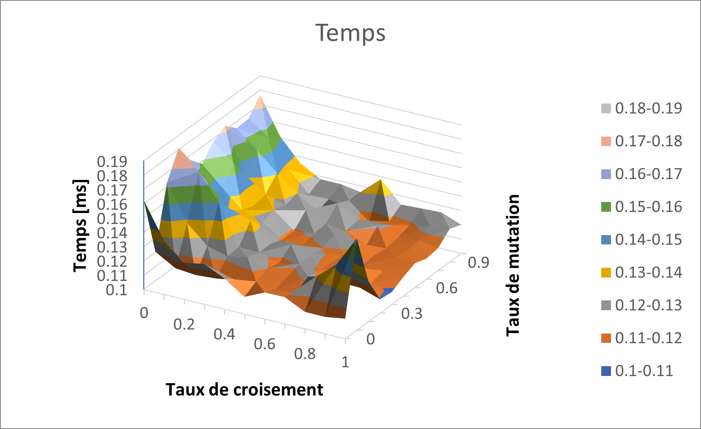
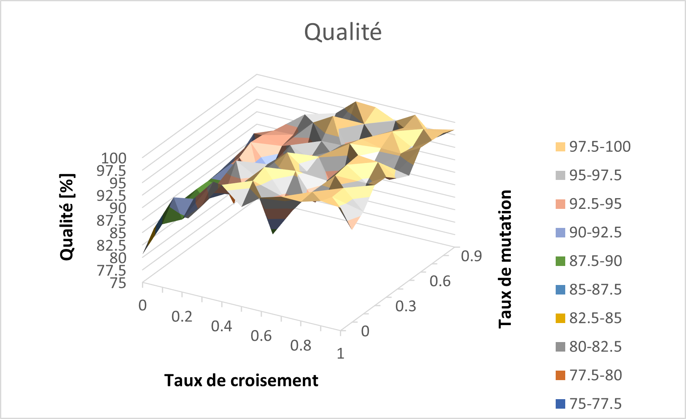
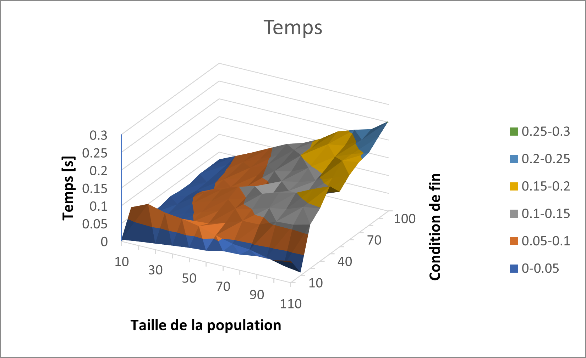
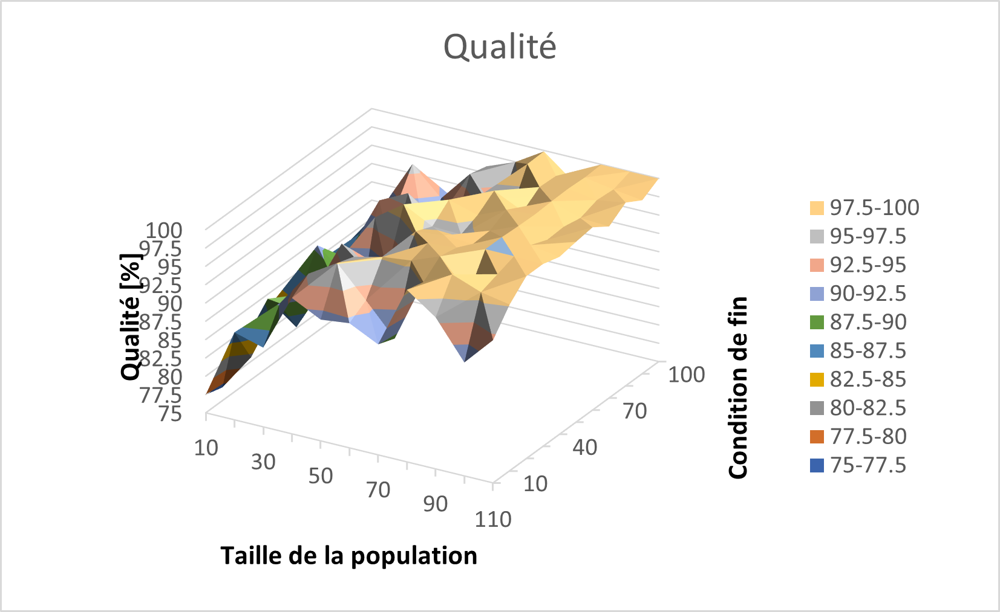

Optimisation
############

L'objectif de cette section est d'optimiser l'algorithme génétique, présenté précédemment, 
servant à la résolution du problème du sac à dos. Deux éléments différents sont étudiés : 
le temps d'exécution du programme, qui doit être minimisé, ainsi que la qualité de la 
solution obtenue, c'est-à-dire à quel point celle-ci est proche de la solution optimale. 
Nous alons la mesurer en comptant le nombre de bits de la solution obtenue semblables à 
la solution optimale et retourner cela sous forme de pourcentage. 
Or, ces résultats dépendent d'une multitude de paramètres différents et il est hautement 
probable qu'ils ne soient pas indépendants les uns des autres, ce qui nous empêche de 
trouver leurs valeurs optimales en les étudiant séparément. C'est pourquoi nous allons en 
étudier qu'un nombre restreint, à savoir les probabilités de croisement, avec un ou deux 
points, et de mutation, la taille de la population et la condition de fin. 

Il serait, de plus, intéressant d'étudier la façon dont les valeurs obtenues évoluent en 
fonction de la taille du génome relatif au problème. Cependant, le temps nécessaire pour 
trouver la solution optimale à l'aide d'une recherche exhaustive évoluant 
exponentiellement avec la taille du génome, il serait alors difficile de déterminer la 
qualité d'une solution pour une telle taille. Il faudrait alors trouver une autre façon 
de déterminer la solution optimale. En se basant sur l'exemple de l'introduction, il 
semble donc que 15 bits soit une taille adéquate et c'est celle-ci qui sera utilisée par 
la suite.

Pour s'assurer de l'indépendance des différents paramètres et ainsi éviter d'avoir des 
données biaisées, ceux-ci ont été testés deux à deux avec tous les autres. Toutes les 
paires ont été testées, pas seulement celles présentes dans les schémas ci-dessous. Il
en ressort qu'ils sont effectivement généralement indépendants car les résultats sont 
constants pour toutes les expériences. 

Probabilités de croisement et de mutation
=========================================

En étudiant ces deux paramètres ensemble, nous pouvons remarquer que, bien que ce soient 
tous deux des opérateurs génétiques, ils n'ont pas le même effet, tant sur le temps 
d'exécution que sur la qualité de la solution obtenue. 

    
    Temps d'exécution de l'algorithme en fonction des taux de mutation et de croisement

Du point de vue du temps d'exécution, le taux de mutation n'a qu'un effet négligeable, à part 
pour des valeurs proches de 0 ou de 1. Cela laisse supposer que pour de petites valeurs les 
chances de rester "coincé" au niveau d'un optimum local est plus grand, tandis qu'avec des 
valeurs trop grandes l'algorithme trouve plus difficilement une solution stable. Cependant, 
les différences sont assez petites pour pouvoir être négligées et tant que la probabilité de 
mutation reste entre 0.3 et 0.8, nous ne constatons pas d'influence particulière. 

Le taux de croisement, quant à lui, à un effet notable. En effet, plus celui-ci est grand, 
moins il faut de temps à l'algorithme pour trouver une solution. Cela prouve l'importance 
de cet opérateur, même s'il peut sembler superflu au premier abord. Prendre une partie du 
génome de plusieurs "bonnes solutions" différentes permet donc de créer un individu enfant 
mieux adapté au problème, malgré le caractère aléatoire de ce partage. 

    
    Qualité de la solution en fonction des taux de mutation et de croisement

Quant à la qualité de la solution retournée par l'algorithme, celle-ci semble être affectée 
plus ou moins de la même manière que le temps. Effectivement, le taux de mutation ne change 
pas de manière décisive la qualité de la solution, alors que le taux de croisement a un effet 
important. Une valeur proche de 1 permet d'obtenir une meilleure solution, ce qui correspond 
également à un temps plus court. Ainsi, il est possible de trouver une valeur pour laquelle 
les deux résultats sont optimisés en prenant un taux de mutation entre 0.2 et 0.8 et un taux 
de croisement plus grand que 0.8. 

Condition de fin et taille de la population
===========================================

À la différence des deux paramètres précédemment étudiés, ceux-ci ont tous les deux une 
importance conséquente sur l'algorithme génétique, en particulier sur son temps d'exécution. 

    
    Temps d'exécution de l'algorithme en fonction de la ondition de fin et de la taille de la 
    population

En effet, de manière générale, le temps que prend l'algorithme évolue linéairement avec chacun 
des deux paramètres. Pour la taille de la population, ce résultat est cohérent avec le fait que 
plus il y a d'individus dans chaque génération, plus il faudra de temps pour effectuer des 
opérations sur chaque individu. La linéarité relative à la condition de fin est également 
cohérente, car le nombre de générations générées par l'algorithme augmente en fonction de ce 
paramètre. 

On observe également une anomalie losrque les deux valeurs sont petites. Celle-ci provient 
sûrement de l'algorithme en lui-même car elle est tout le temps présente, indépendamment 
des valeurs que prennent les paramètres. 

    
    Temps d'exécution de l'algorithme en fonction de la ondition de fin et de la taille de la 
    population
