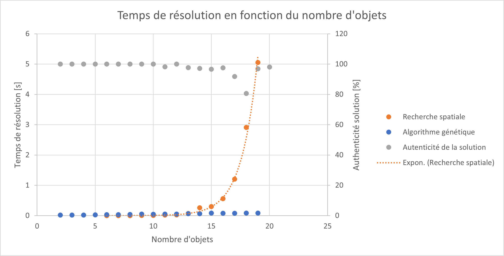

.. _introduction.rst:

Introduction
############

A la fin du XX :sup:`e` siècle, le *Clay Mathematics Institute* décide de récompenser 
par un million de dollars la résolution de sept problèmes mathématiques. Aujourd'hui 
seul un de ces problèmes a été résolu et parmi ceux restant, nous pouvons retrouver P = NP.
Dans celui-ci, il s'agit de démontrer que la solution des problèmes dont la solution peut être 
rapidemment vérifiée peut, elle-même, être rapidemment trouvée. Par rapidemment on entend 
un temps polynomial, c'est-à-dire que le temps nécessaire est proportionnel à une puissance 
de la taille du problème. Un exemple d'un tel problème est le problème du sac à dos ou 
Knapsack Problem. Il consiste à remplir un sac en choisissant parmi une liste d'objets 
ayant une valeur et une masse ceux qui permettent de maximiser la valeur transportée sans 
dépasser la limite de poids maximale. Ce problème étant NP, une méthode de résolution en 
temps polynomial n'a pas encore été trouvée mais il existe des méthodes en temps exponentiel 
comme, par exemple, le fait de générer toutes les combinaisons d'objets possibles, pour ensuite 
déterminer celle qui est optimale. Le fait d'explorer d'une telle façon tout l'espace de 
recherche est efficace pour un petit nombre d'objets mais n'est pas applicable pour de plus 
grands nombres car le temps nécessaire pour cela grandit exponentiellement avec le nombre 
d'objets. Cependant, d'autres approches sont également possibles tels les algorithmes 
génétiques. Dans le cas d'un problème tel celui du sac à dos, la solution approximative est 
trouvée dans un temps significativement plus court qu'avec la première méthode. 

  Comparaison de l'évaluation de toutes les solutions et de l'algorithme génétique

Nous pouvons effectivement voir cela dans la figure ci-dessus. On y voit également que 
l'authenticité de la réponse, c'est-à-dire le pourcentage de différence entre la solution 
optimale et celle trouvée par l'algorithme génétique reste au-dessus de 80% pour un algorithme 
n'ayant pas été optimisé. Le but de ce travail est donc de comprendre comment fonctionne ce 
type d'algorithmes et de l'optimiser pour la résolution du problème du sac à dos.