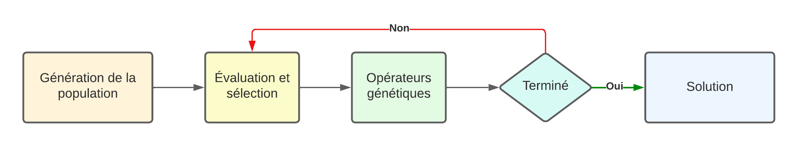
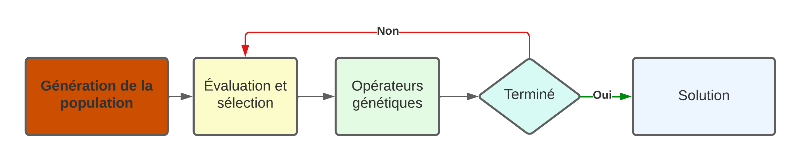
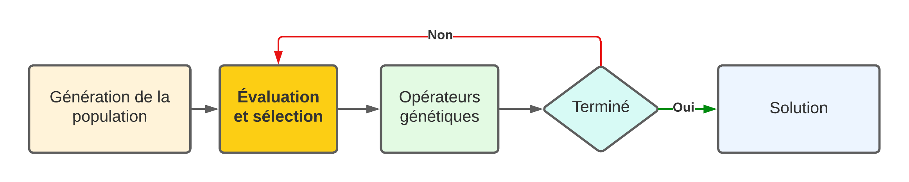
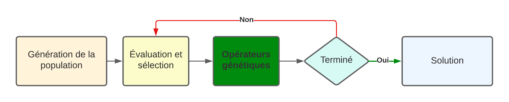
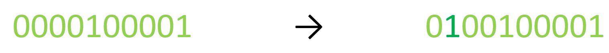
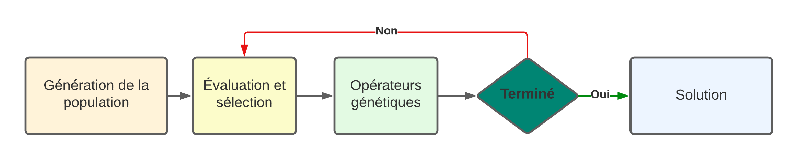

Les Algorithmes génétiques
##########################

Principe général 
======================

Développés depuis les années 60 par le scientifique américain John Holland, les algorithmes 
génétiques sont un type d'algorithmes s'inspirant de la théorie de l'évolution de Charles 
Darwin pour trouver la solution à un problème d'optimisation. Pour cela, on crée un ensemble 
de potentielles solutions dont les meilleures seront sélectionnées pour engendrées de 
nouvelles solutions suposément meilleures.  

Le fonctionnement d'un tel algorithme peut être représenté de manière simplifié comme cela:

Ainsi les étapes importantes de cet algorithme sont la génération de la population, 
l'évaluation et la sélection des individus et les opérateurs génétiques. Ces deux dernières 
étapes sont répétées jusqu'à ce que l'on obtienne une solution satisfaisante que sera retournée. 

.. admonition:: Vocabulaire

    Durant ce travail, nous utiliserons un vocabulaire spécifique aux algorithmes génétiques.
    L'ensemble de solutions potentielles avec lesquelles nous travaillerons est appelé 
    **population**, chaque solution potentielle est appelée **induvidu**, une caractéristique 
    d'un individu est appelée **gène** et l'ensemble de ces gènes est appelé **génome**.

Génération de la population 
===========================

Représentation du génome
------------------------

Pour pouvoir mettre en application un algorithme génétique, il faut tout d'abord pouvoir
modéliser les individus et leur génombre de manière efficace. Il existe plusieurs 
façons de faire cela mais la plus simple est la représentation binaire. Cela consiste à 
représenter le génome par une chaîne binaire composée de "0" et de "1. Dans le cas du 
problème du sac à dos, chaque objet pouvant être mis dans le sac est un des gènes et sa 
présence ou son absence sont indiquées par respectivement un "1" ou un "0". 

Voici un exemple de liste d'objets susceptibles d'être dans le sac dont la limite est 
3000 g tiré de :cite:`kp_exemple` :

+------------+--------+-------+
| Objet      | Valeur | Poids | 
+============+========+=======+
| Casquette  | 100    | 70 g  |
+------------+--------+-------+
| Chaussettes| 10     | 38 g  |
+------------+--------+-------+
| Tasse      | 60     | 350 g |
+------------+--------+-------+
| Bouteille  | 30     | 192 g |
+------------+--------+-------+
| Ordinateur | 500    | 2200 g|
+------------+--------+-------+
| Écouteurs  | 150    | 160 g |
+------------+--------+-------+
| Téléphone  | 500    | 200 g |
+------------+--------+-------+
| Bonbons    | 5      | 25 g  |
+------------+--------+-------+
| Bloc-note  | 40     | 333 g |
+------------+--------+-------+
| Mouchoirs  | 15     | 80 g  |
+------------+--------+-------+

Le génome correspondant à la situation où le sac contient seulement l'ordinateur et des 
mouchoirs serait "0000100001". 

Le fait de coder le génome d'un individu de cette façon a l'avantage d'être simple donne 
de nombreuses possibilité d'enjambements mais pour certains problèmes cette représentation 
semble peu naturelle. Par exemple, si l'on cherche une chaîne de caractères, il est plus 
évident que chaque gène soit un des caractères de la chaîne. C'est pour cela qu'on utilise 
un codage se basant sur des nombres entiers, des nombres à virgule flottante ou des caractères 
quelconques. Il existe également différentes façons de représenter le génome, par exemple sous 
forme d'arbre, ou d'optimiser son codage comme le *Gray coding* mais la façon dont les 
individus sont modélisés dépend essentiellement du problème auquel on fait face 
et sert de base pour toutes les opérations qui agiront sur leur génome. 

Population initiale
-------------------

Une fois la représentation des individus choisie, il faut ensuite générer la population 
qui va évoluer. Pour cela, la méthode la plus utilisée consiste à générer de manière 
aléatoire un certain nombre d'individus. Il n'existe pas de méthode générale pour déterminer 
le nombre d'individus optimal pour un problème donné mais, de manière générale, un grand nombre 
d'individus est un avantage, car cela crée une plus grande diversité et réduit les probabilités 
de converger vers un maximum local. Cependant, il faut prendre en compte les limitations techniques
et utiliser des valeurs réalistes. 

Cette population représente la première génération d'individus. Il va ensuite s'agir de la faire 
évoluer pour donner naissance à d'autres générations mieux adaptées au problème. La première 
étape de cette évolution est l'évaluation. 

Évaluation et sélection
=======================

Évaluation
----------

L'évaluation de la population consiste à déterminer quantitativement quels individus sont 
les mieux adaptés au problème posé. On utilise une fonction nommée *fitness function* pour 
cela. Cette fonction assigne une valeur plus ou moins grande à chaque individu, récompensant 
d'avantage les *meilleurs* et moins les *moins bons*. La façon de calculer cela dépend encore une 
fois du problème. Elle doit non seulement pouvoir déterminer les individus qui correspondent
à une solution du problème, mais aussi pouvoir classer ceux qui n'y correspondent pas ; une 
telle fonction retournant "1" pour les solutions du problème et "0" pour les autres individus 
serait très mauvaise car elle rendrait impossible l'amélioration.

La *fitness function* du problème du sac à dos cherche à maximiser la valeur transportée tout
en respectant la limite de poids imposée. Elle peut être conçue de la façon suivante :

.. literalinclude:: scripts/exemple.py
    :lines: 1-5

Ainsi, la valeur (*fitness score*) correspondant au génome "0000100001", c'est-à-dire que 
le sac ne contient que l'ordinateur et des mouchoirs serait 515 alors que celle correspondant 
à "1111111111" serait 0 car le poids d'un sac contenant tous les objets exéderait la limite fixée. 

Cette fonction revêt également un rôle essentiel pour un algorithme génétique, car c'est 
généralement elle qui prend le plus de temps à être évaluée et qui influence donc largement 
le temps d'exécution de l'algorithme. Il est donc nécessaire de la rendre la plus efficace 
possible pour économiser du temps. 

Sélection
---------

Après l'évaluation des individus, il s'agit de passer à leur sélection. Comme dans la nature 
où les individus les mieux adaptés à l'environnement survivent et peuvent donner naissance à
la génération suivante, la séléction consiste à choisir parmi les différents individus ceux qui 
vont transmettre leur génome à la génération suivante. Il existe plusieurs façons de déterminer 
ces parents. 

Premièrement, il y a la sélection par *roue de la fortune* qui consiste à 
sélectionner un individu de manière aléatoire de telle manière que la probabilité d'être choisi soit
proportionnelle à la valeur de l'évaluation. Cette méthode est efficace car elle prend en compte 
l'adaptation au problème. Cependant elle peut être difficile à appliquer et un individu risque d'être 
sélectionné plusieurs fois. Une autre manière de sélectionner des individus est nommée 
*Stochastic universal sampling* (SUS) et permet de réduire ce risque et d'augmenter les chances 
de sélectionner au moins une fois des meilleurs individus.

Il y a également la sélection par rang où l'on sélectionne arbitrairement les k meilleurs individus. 
Cela simplifie le processus, mais la sélection se fait indépendamment des valeurs d'évaluation. 
Cette méthode se révèle efficace losque les valeurs d'évaluation sont très proches, notamment 
en fin de simulation.

De plus, on peut retrouver la sélection par tournoi. On choisi un nombre arbitraire d'individus 
aléatoirement parmi la population et on sélectionne le meilleur de ce groupe. Puis, ce processus 
est répété jusqu'à avoir le bon nombre de parents. Les avantages de cette méthode sont sa 
simplicité de mise en œuvre et son efficacité à être implémentée sur une architecture en 
parallèle :cite:`Miller1995GeneticAT`. 

D'autres méthodes de sélection existent encore comme la sélection aléatoire ou la sélection 
basée sur une récompense, qui ne seront pas détaillées ici. Les individus sélectionnés ne 
représentent cependant pas forcément la totalité de la génération suivante et une partie de 
celle-ci peut être générée aléatoirement comme pour la première génération, ce qui permet 
d'amener de nouveaux gènes qui n'étaient pas présents auparavant.

Opérateurs génétiques
=====================

Les individus sélectionnés sont donc les meilleurs de leur génération mais pas forcément 
les meilleures solutions au problème. Or, la seule autre option pour l'instant à notre 
disposition est de générer d'autres individus aléatoirement ce qui a peut de chances 
de donner une meilleure solution, surtout si le génome est grand. C'est pourquoi, nous 
utilisons des opérateurs génétiques qui permettent de générer de nouveaux individus 
en se basant sur ceux de la génération précédente, ce qui favorise l'émergence de 
meilleures solutions. Ces opérateurs sont les mutations et les croisements (*crossover*).

Mutations
---------

Les mutations consistent à changer aléatoirement un gène ou un petit nombre de gènes au sein 
du génome. Dans le cas d'un codage binaire, cela peut simplement se résumer à l'inversion 
d'un bit. Dans d'autres cas la valeur du gène peut être redéfinie aléatoirement ou alors on 
peut changer l'ordre d'un groupe de gènes. 

  Exemple de mutation en codage binaire

La fréquence à laquelle ces mutations ont lieu 
est un paramètre essentiel de l'algorithme. Une valeur trop basse peut ne pas apporter assez 
de diversité aux individus alors qu'une valeur trop grande, bien qu'elle permette d'explorer 
plus amplement l'espace de recherche, peut amener l'algorithme à rester coincé dans des optima 
locaux :cite:`baeldung:mutation`.  

Croisements
-----------

Les croisements, quant à eux, consistent à générer un individu "enfant" à partir de deux 
individus "parents". La façon la plus courante de faire cela est de choisir une valeur 
aléatoire k comprise entre 0 et n, la longueur du génome, et ensuite d'échanger tous 
les gènes à partir de cette valeur-là chez les parents pour créer deux enfants.

Il et également possible de faire cela à plusieurs endroits dans le génome, ce qu'on 
appelle *multiple point crossover* par opposition au *single point crossover*. 

..  only:: html

    ..  grid:: 1 2 2 2

        ..  grid-item::

            ..  figure:: figures/singleCrossover.png
                :align: center
                
                Single Point Crossover :cite:`GeeksForGeeks:crossover`

        ..  grid-item::

            ..  figure:: figures/twopointCrossover.png
                :align: center

                Two Points Crossover :cite:`GeeksForGeeks:crossover`

..  raw:: latex

    \begin{figure}
    \centering
    \begin{minipage}{0.45\textwidth}
        \centering
        \includegraphics[width=0.9\textwidth]{figures/singleCrossover.png}
        \caption{Single Point Crossover :cite:`GeeksForGeeks:crossover`}
    \end{minipage}\hfill
    \begin{minipage}{0.45\textwidth}
        \centering
        \includegraphics[width=0.9\textwidth]{figures/twopointCrossover.png} 
        \caption{Two Points Crossover :cite:`GeeksForGeeks:crossover`}
    \end{minipage}
\end{figure}

La probabilité pour un croisement d'avoir lieu est aussi un paramètre de l'algorithme, 
au même titre que son homologue pour les mutations, et revêt également une forte importance.
En effet une valeur adéquate permet d'exploiter au mieux les meilleurs individus parents sans 
rester bloqué sur un optimum local. 

Élitisme
--------

Ces opérateur permettent, certes, d'augmenter la diversité pour trouver de nouvelles solutions 
mais ils peuvent aussi dégrader les meilleurs individus. C'est pouquoi on a recours à l'élitisme. 
En effet, ce procédé permet de transmettre le génome complet du ou des meilleurs individus, sans 
que ceux-ci ne soient altérés, les préservant ainsi d'être affectés par les croisements et mutations. 
Ces individus peuvent cependant être tout de même utilisés pour générer d'autres enfants à l'aide 
de ces opérateurs. 

Fin de l'algorithme
===========================

Ainsi, génération après génération l'algorithme évalue et séléctionnne les meilleurs 
individus et leur applique les différents opérateurs génétiques affin de générer la 
génération suivante. Or, il est nécessaire de pouvoir arrêter cette boucle lorsque le 
résultat obtenu est satisfaisant. Une manière efficace de le faire est de fixer un 
nombre de générations, durant lesquelles le meilleur individu reste le même, au bout 
desquelles l'algorithme se termine. Nous appelerons ce nombre la condition de fin. 
